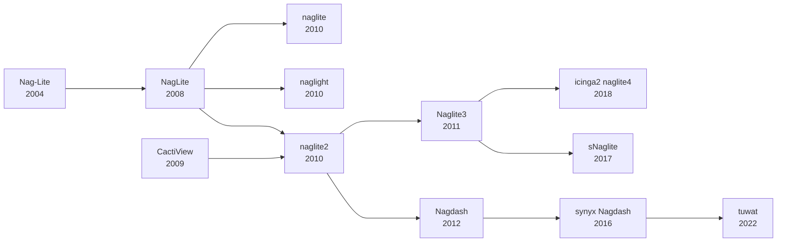

# tuwat history

Tuwat is a replacement for the venerable [Nagdash] which had been adapted time
and time again to provide a view into an evolving infrastructure.

### tuwat

tuwat was created to fill a few holes in Nagdash.

* decrease RAM usage
* cache results
* add more connectors, not only Nagios API

For a history of tuwat itself, see the [`CHANGELOG.md`](../CHANGELOG.md).

## Forks and Versions and Adaptions

### Links

* [Nag-Lite] Dec 09, 2004
* [NagLite] Apr 10, 2008
* [naglite] Oct 25, 2009
* [CactiView] Dec 6, 2009
* [naglite2] Mar 25, 2010
* [naglight] Oct 30, 2010
* [Naglite3] Jan 22, 2011
* [Nagdash] Nov 19, 2012
* [synyx Nagdash] Nov 30, 2016
* [sNaglite] Mar 27, 2017
* [icinga2-naglite4] Dec 28, 2018
* [tuwat] Sep 24, 2022

[Naglite3]: https://github.com/saz/Naglite3
[naglite2]: https://github.com/lozzd/naglite2
[Nagdash]: https://github.com/lozzd/Nagdash
[naglite]: https://github.com/oldbayindustries/naglite/
[icinga2-naglite4]: https://github.com/wftech/icinga2-naglite4
[sNaglite]: https://github.com/SectorNordAG/sNaglite
[naglight]: https://github.com/RECIA/naglight
[tuwat]: https://github.com/synyx/tuwat
[CactiView]: https://github.com/lozzd/CactiView
[NagLite]: https://web.archive.org/web/20081209054042/http://naguser.dk/?p=8
[Nag-Lite]: https://web.archive.org/web/20081210082044/http://www.nagiosexchange.org/cgi-bin/page.cgi?g=Detailed%2F1633.html;d=1
[synyx Nagdash]: https://x.com/bujo84/status/1022102868042698753
